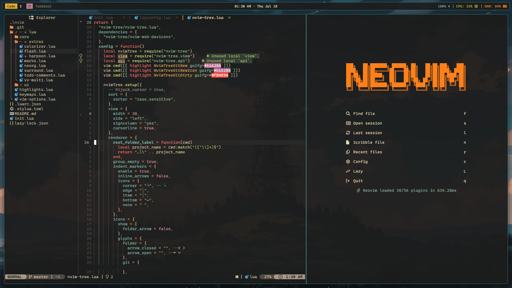

# Neovim Configuration

This is my Neovim text editor configuration that I use to write code for all my projects. This configuration repo is managed from scratch I didn't use any distribution.



## Installation 🚀

- Install Neovim (I prefer a package manager to install tools and plugins, my package manager of choice is [Scoop](https://scoop.sh/) since I use Windows):
  ```shell
  scoop bucket add extras
  scoop install extras/neovim
  ```
- On Windows clang is needed in order for treesitter to work, so you have to install **LLVM**. The easiest way is to use Scoop:
  ```shell
  sccop bucket add main
  scoop install main/llvm
  ```
- Install [ripgrep ](https://github.com/BurntSushi/ripgrep) and [fzf](https://github.com/junegunn/fzf).
- Clone the repository and move it to your nvim config directory/folder.
  on Windows this folder is located at `$HOME\AppData\Local\nvim`:
  ```shell
  cd $HOME\AppData\Local
  git clone https://github.com/Mahmoud-Azamtta/nvim-config.git
  ```
  <u><strong>Note:</strong></u> make sure to create a backup of your existing nvim directory/folder before cloning.
- Launch Neovim with the command: `nvim`.

## File structure 🌳

[Lazy.nvim](https://github.com/folke/lazy.nvim) is the plugin manager I use to manage my Neovim plugins, in the `init.lua` file located at the root directory, first I initiate Lazy.nvim and then require the essential files. The `require` Lua function can only see files in a directory called `lua` and it must be in the project's root directory.

Then lazy is required to import plugins. I categorised my plugins into three types core, ui, and extras, with each plugin located in a directory named after its type.

### Essential files

- `vim-options.lua`: to override some vim's defaults and define vim options.
- `keymaps.lua`: in it I set my key maps (These keymaps usually is not related to any of the installed plugins, each plugin keymaps is set in its config function).
- `highlights.lua`: to override highlights.

### Core plugins ⚗️

- Plugins that in my opinion is a must for a text editor, for managing completions, syntax highlighting, formatters, and linters.
- [Telescope](https://github.com/nvim-telescope/telescope.nvim) is a fuzzy finder which helps in navigating between files easily and fast, also most plugins uses it as a dependency. If you use Neovim without telescope there is something wrong with you, for real :) .
- [Mason](https://github.com/williamboman/mason.nvim) for managing LSPs.
- I also use a couple of very simple plugins for managing sessions, folds, auto pairs, and comments:
  1.  Sessions: [persistence.nvim](https://github.com/folke/persistence.nvim).
  2.  Folds: [nvim-ufo](https://github.com/kevinhwang91/nvim-ufo).
  3.  Auto pairs: [nvim-autopairs](https://github.com/windwp/nvim-autopairs) and [nvim-ts-autotag](https://github.com/windwp/nvim-ts-autotag).
  4.  Comments: [comment.nvim](https://github.com/numToStr/Comment.nvim).
      I can't use the text editor without these.

### UI Plugins 🎨

The most important ones are, that will make Neovim visually appealing:

- [Bufferline](https://github.com/akinsho/bufferline.nvim).
- [NvimTree](https://github.com/nvim-tree/nvim-tree.lua).
- [Lualine](https://github.com/nvim-lualine/lualine.nvim).
- [Alpha](https://github.com/goolord/alpha-nvim).
- [Web devicons](https://github.com/nvim-tree/nvim-web-devicons).
  And for the color scheme I use [Gruvbox material](https://github.com/sainnhe/gruvbox-material)

### Extras ➕

I won't talk about the extras, because not all people find these useful. But for me I like using them, so if you're interested you can check them in the code.

## Additional advice 🤖

If you don't want to use Neovim, just give Vim motions a shot in your preferred text editor.
